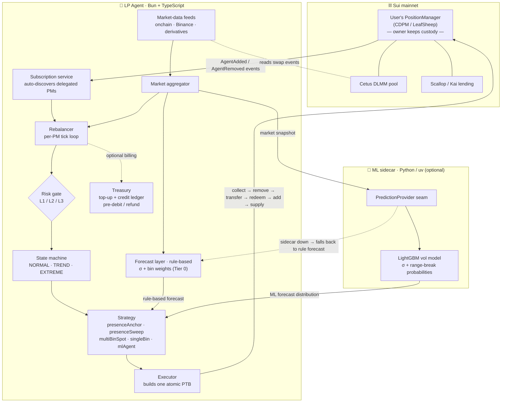

# LP Agent

> An **open-source framework for non-custodial LP agents on Sui** — a reference implementation you fork and run yourself, not a hosted app. It **scaffolds the whole agent** — the Move custody boundary, L1/L2/L3 risk breakers, atomic multi-protocol execution, idle-asset lending, and a ready-to-ship user portal — so you bring one thing: **the strategy**. The reference agent forecasts short-term **volatility** (not price direction) and shapes Cetus DLMM liquidity as a vol-scaled band around the market — earning swap fees, capturing buy-low/sell-high spread, and parking idle capital in lending — all while running **inside a Move permission boundary that makes withdrawal impossible**. The user keeps custody; the agent can touch the position, never the exit.

It plugs into [LeafSheep](https://app.leafsheep.xyz)'s `PositionManager` delegation slot, auto-discovers work from on-chain `AgentAdded` events, and submits each rebalance as one atomic PTB. There is no central service: each deployer owns their own risk policy, capital limits, fee design, and trained model. The design thesis is laid out in the essay *"Market Making Is a Forecasting Problem: The Design of an Open-Source LP Agent for Sui"* — LP is a forecasting problem, and σ matters more than μ **literally**: walk-forward analysis falsified our own price-direction predictor (the q50 center placed no better than spot), so we removed it and kept only the volatility head, placing liquidity as a σ-scaled band centered on spot. Directional posture is handled by rule-based regime gates, not a trained center head — the burden of proof to reintroduce one is documented in `docs/decision-remove-center-prediction.md`.

Bun + TypeScript + SQLite (agent) · uv + Python, LightGBM (ML pipeline). ~18K LOC, 930+ bun tests + ~120 pytest tests, Apache-2.0.

**v1 has landed**: the ML prediction pipeline lives in-tree — a Python training + inference sidecar (`ml/`, managed with uv; **vol-only by design** — the mean-price head was falsified by walk-forward and removed, see `docs/decision-remove-center-prediction.md`), the `mlAgent` strategy, a three-state machine (`src/state`), layered circuit-breaker risk controls (`src/risk`), and shadow mode (`src/services/shadowRunner`). **The repo ships the pipeline and the framework, not trained models** — model artifacts stay out of git; forks retrain on the same pipeline. Bring your own strategies, your own pools, your own models.

## What it does

- **Algorithmic rebalancing** — five registered strategies, each rebalance submitted as one atomic PTB:
  - **`presenceAnchor` / `presenceSweep`** (mainline, under forward shadow A/B) — regime-gated market *presence*: NORMAL/TREND/DEFENSE nowcast from realized vol-ratio + drift, σ-scaled width, a clamped 4h-anchor reversion tilt, and withdraw-only defense (the agent has no taker permission — leaving the market IS the defense). `presenceSweep` adds the anchor-boundary flip-sweep / freeze discipline.
  - **`multiBinSpot`** (Tier 0) — rule-based log-normal distribution placement; the explicit fallback whenever the ML sidecar is degraded. **`singleBin`** — simplest reference baseline.
  - **`mlAgent`** — consumes the vol model through `PredictionProvider` (σ width + range-break probabilities; the range always centers on the active bin — no direction is predicted, by evidence, not by omission).
  - (`emaTrend` was **removed**: its premise — predictable short-horizon direction — measured at coin-flip accuracy in walk-forward and out-of-sample, and its trend-biased placement is a directional bet the evidence says nobody should take. `docs/decision-remove-center-prediction.md` records the falsification; recover the code from git history if you want a directional-strategy skeleton.)
- **Idle-asset lending** — Scallop + Kai SAV integration, APY-aware router (25 bps Scallop tie-break), per-coin dust thresholds.
- **Multi-source price feeds** — on-chain Cetus `SwapEvent` and Binance REST implementations behind one `PriceFeed` interface, sharing a `price_observations` history table.
- **Automatic PM discovery** — the agent address is derived from `MNEMONICS`, the agent listens for on-chain `AgentAdded` events and adds the `PositionManager` to its monitor; `AgentRemoved` / `PositionManagerClosed` remove it automatically.
- **User top-up accounting** — per-user derived deposit addresses, a SQLite credit ledger, a periodic watcher that credits inbound deposits, APY-aware conversion rates. Deposit addresses typically hold only stablecoins; operator sweep (`treasury-sweep.ts`) and refund (`treasury-refund.ts`) use Sui's protocol-level gasless stablecoin transfers (mainnet, 2026-05-20) for USDC and the other six allowlisted coins — the deposit address needs zero SUI for gas. The watcher merges coin-object balances and address-balance accumulator balances (from gasless deposits) into a single observed total, so both deposit paths are credited correctly. Non-allowlisted coins and the explicit `--force-gas` flag fall back to the legacy coin-object path.
- **CDPM permission boundary** — all operations go through the LeafSheep `PositionManager`; user funds never leave the user's own vault.

## What it does **not** do (deliberately left to forks)

- ❌ No trained models — the ML pipeline is in-tree (`ml/`), but the model artifacts (the alpha) are yours to train
- ❌ No LLM signal layer / news ingestion — future external signals plug in via a `PredictionProvider` decorator or inside the sidecar, never as framework changes
- ❌ No cross-chain support (Sui mainnet only)
- ❌ No public HTTP API — SQLite + CLI scripts only, plus an optional bind-local treasury HTTP API (`TREASURY_HTTP_ENABLED`, off by default; never expose it raw to the internet)
- ❌ No user-initiated refunds (operator sweeps manually)

## Architecture

The chain is the control plane: users delegate a `PositionManager` on-chain, the agent auto-discovers it, and every decision leaves as **one atomic PTB** that can touch the position but never withdraw from it.



**Legend — each box maps to a module** (`ID` is the diagram node id):

| Box | ID | Source |
|---|---|---|
| Subscription service | `SUB` | `src/services/subscriptions.ts` |
| Rebalancer (tick loop) | `REB` | `src/services/rebalancer.ts` |
| Market-data feeds | `FEEDS` | `src/data/feeds/` (onchain · binance · binanceMulti · derivatives · cetusEvents) |
| Market aggregator | `AGG` | `src/data/marketAggregator.ts` |
| Risk gate L1/L2/L3 | `RISK` | `src/risk/` |
| State machine | `STATE` | `src/state/` |
| Strategy | `STRAT` | `src/strategies/` |
| Forecast layer (rule-based, Tier 0) | `FC` | `src/forecast/` (σ estimators + bin-weight mapping) |
| Executor (atomic PTB) | `EXEC` | `src/services/executor.ts` |
| Treasury (billing) | `TRE` | `src/treasury/` |
| PredictionProvider seam | `PRED` | `src/prediction/` |
| LightGBM vol model | `LGBM` | `ml/` (Python sidecar, uv-managed) — vol-only by design; the center head was falsified and removed, see `docs/decision-remove-center-prediction.md` |
| PositionManager / pool / lending | `PM` · `POOL` · `LEND` | on-chain: CDPM PositionManager, Cetus DLMM pool, Scallop/Kai (adapters in `src/sui/lending/`) |

**One tick, per subscribed PM:** fetch PM state + pool active bin + spot + history → pre-tick **risk** check → **state** machine eval → **strategy** plan — consuming either the ML prediction or the rule-based **forecast** layer (σ + bin weights), plus the state params → lending router decides redeem/supply → (optional) **treasury** pre-debit → **executor** submits the unified PTB → on failure refund the charge → record to SQLite. The ML sidecar is consumed only through the `PredictionProvider` seam; if it is unavailable the agent degrades explicitly to the rule-based forecast (the Tier 0 floor) and logs the reason — never a silent fallback.

> The repo ships the framework and the pipeline drawn above — **not** the trained model that sits behind the `PredictionProvider` seam. Forks train their own. See [`docs/project-overview.md`](./docs/project-overview.md) for the module-level map.

## Quick start

```bash
# 1. Install
bun install                              # aftermath override pinned to 2.0.1

# 2. Configure (.env file)
cp .env.example .env                     # edit in your secrets
                                         # Required:
                                         #   - AGENT_MNEMONICS or AGENT_PRIVATE_KEY
                                         #   - EXPECTED_AGENT_ADDRESS (guards against the wrong mnemonic)
                                         #   - SUI_USDC_POOL_ID (mainnet pool id)
                                         # Missing fields are reported in one batch at startup.
                                         # ML / risk env vars (sidecar URL, shadow mode,
                                         # risk thresholds) are documented in .env.example.

# 3. Verify key derivation
#    Derive the address from your mnemonic at AGENT_DERIVATION_PATH and
#    compare it with EXPECTED_AGENT_ADDRESS — the runtime enforces the
#    match at startup and aborts on mismatch. (scripts/ is operator-local
#    and not shipped; write your own probe there, see CLAUDE.md.)

# 4. Static integrity
bun run typecheck && bun test            # should be 930+ pass
cd ml && uv sync && uv run pytest        # (optional) ML pipeline, ~100 pass

# 5. Run
bun start
```

## Extension points (the core value of the framework)

Five clearly carved extension seams — each has a ready-made interface; one registration line or one new file is all it takes:

### 1. Add a strategy

A strategy is one file implementing the `Strategy` interface (`src/strategies/types.ts`). It is a **pure decision function**: given a market snapshot it returns *what to do*, and the framework owns everything else — risk gating, atomic PTB execution, lending of idle capital, custody boundary, journaling, shadow validation. **You write `plan()`; the framework provides the rest.**

**The interface** — three members, only `plan` is required:

```ts
export interface Strategy {
  readonly name: string;
  readonly historyWindowMs?: number;              // price history you need (default 5 min)
  plan(input: StrategyInput): Promise<StrategyOutput>;
}
```

**What `plan()` receives** (`StrategyInput`):

| Field | Type | What it is |
|---|---|---|
| `pm` | `PMState` | Your PM: `balance.{a,b}`, `feeBag.{a,b}`, `positionBins[]`, `lending`, `positionValue` — all **PHYSICAL** coin amounts (coinA/coinB as the pool holds them) |
| `pool` | `PoolState` | `activeBinId`, `binStep`, `feeRateBps` |
| `spot` | `PriceObservation` | Current quote price (coinB-per-coinA, decimal-adjusted) + timestamp |
| `history` | `PriceObservation[]` | Price history over `historyWindowMs`. **This is your feature source** — feed it to your own σ estimator, LLM client, external signal, anything |
| `profile` | `PoolProfile` | Pool metadata + orientation. Route every bin↔price decision through `src/domain/binMath.ts` (`humanPriceForBin` / `binDirection` / `orientationOf`) |

**What `plan()` returns** — one of four `StrategyOutput` kinds:

| Kind | Meaning |
|---|---|
| `{ kind: "plan_and_reconcile", plan }` | Execute the rebalance PTB **and** run lending reconciliation (cover shortfall + deploy idle). The normal path. |
| `{ kind: "plan_only", plan }` | Execute the rebalance, skip lending (tactical move, e.g. fee harvest) |
| `{ kind: "reconcile_only", reason }` | No rebalance — just capture idle yield / cover a shortfall |
| `{ kind: "quiet", reason }` | Do nothing this tick |

The `plan` you build is a `RebalancePlan` (`src/domain/types.ts`): `removeShares` (drained first), then `addBins[]` / `addAmountsA[]` / `addAmountsB[]` (placed second, same length), `collectFees`, and a free-form `reason` captured into the journal.

**Two contracts your `plan` must honor** (both verified on mainnet — see `CLAUDE.md` → *Load-bearing execution facts*):

- **Bin orientation** — bins **above** the active bin hold physical **coinA** only; bins **below** hold **coinB** only; **never place on the active bin** (composition-fee policy). Split your capital by side accordingly. Do not assume "bin up = price up" — the SUI/USDC pool is inverted; go through `binMath.ts`.
- **Sizing** — size `addAmounts*` from the **pre-remove** snapshot (`pm.balance` + fee bag when `collectFees` + `pm.positionValue`). The rebalancer re-scales your per-bin amounts to the actual post-remove balances, so you work in ratios, not realized amounts.

**Skeleton** (copy `multiBinSpot.ts` — 286 lines, zero ML deps — and replace only the distribution step with your alpha):

```ts
// src/strategies/myStrategy.ts
import type { Strategy, StrategyInput, StrategyOutput } from "./types.ts";
import { orientationOf } from "../domain/binMath.ts";

export function createMyStrategy(): Strategy {
  return {
    name: "myStrategy",
    historyWindowMs: 60 * 60 * 1000,             // e.g. 1h — omit for the 5-min default
    async plan(input: StrategyInput): Promise<StrategyOutput> {
      const { pm, pool, spot, history, profile } = input;

      // 0. Guard: empty PM / bad price → quiet
      if (pm.balance.a === 0n && pm.balance.b === 0n && pm.positionBins.length === 0)
        return { kind: "quiet", reason: "myStrategy: empty PM" };

      // 1. YOUR ALPHA: turn `history` (+ optional PredictionProvider, external
      //    signal, LLM call) into a target bin range + per-bin weights.
      const orientation = orientationOf(profile);
      // ... compute targetBins, weights ...

      // 2. Split capital by the physical-side rule (bins above active → coinA,
      //    below → coinB, active excluded); build addBins / addAmountsA / addAmountsB.

      // 3. Decide trigger (recenter? drift? fees-only?) and return:
      return {
        kind: "plan_and_reconcile",
        plan: {
          pmId: pm.pmId,
          removeShares: new Map(/* current bins → shares, to redeploy from scratch */),
          addAmountA: 0n, addAmountB: 0n,
          addBins: [], addAmountsA: [], addAmountsB: [],
          collectFees: pm.feeBag.a > 0n || pm.feeBag.b > 0n,
          reason: "myStrategy: recenter",
          plannedActiveBinId: pool.activeBinId,
        },
      };
    },
  };
}
```

**Register** — three edits, all in `src/strategies/registry.ts`:

```ts
import { createMyStrategy } from "./myStrategy.ts";        // 1. import

export type StrategyName =
  | "singleBin" | "multiBinSpot"
  | "presenceAnchor" | "presenceSweep" | "mlAgent"
  | "myStrategy";                                          // 2. add to the union

const BUILDERS: Record<Exclude<StrategyName, "mlAgent">, () => Strategy> = {
  // ...existing...
  myStrategy: () => createMyStrategy(),                    // 3. add to BUILDERS
};
```

The `StrategyName` union is **exhaustive and type-checked** — if you forget to register, `bun run typecheck` fails. That's the seam working: registration is compiler-enforced, not convention.

**Run it**: `STRATEGY=myStrategy bun start`.

**Validate before you go live** (all provided by the framework, no extra wiring for the first two):

- `bun run typecheck && bun test` — the exhaustive union + the strategy test suite catch wiring errors.
- Add a unit test under `tests/strategies/` (copy `tests/strategies/presenceAnchor.test.ts` — feed a fixture `StrategyInput`, assert the `StrategyOutput`). No chain needed.
- **Shadow mode** — validate the decisions against a rule baseline on live market data with **zero capital at risk** before submitting a single PTB (`src/services/shadowRunner`, `ML_SHADOW_MODE=true`; score with `shadow-report`). The shadow harness currently compares against the rule baseline — slot your strategy in as the candidate to A/B it.

References: `singleBin.ts` (109 lines, simplest) · `multiBinSpot.ts` (probability-distribution placement) · `presenceAnchor.ts` (regime-gated, declares a 4h `historyWindowMs`).

### 2. Add a pool profile

```ts
// src/pools/eth-usdc.ts
export function buildEthUsdcProfile(): PoolProfile { /* ... */ }
```

Add one line to the `BUILDERS` map in `src/pools/index.ts`. Then `POOL_PROFILE=eth-usdc bun start`.

### 3. Add a lending protocol

Mirror `src/sui/lending/scallop.ts` as a new adapter, add a protocol branch to `pickHighestApy` in `src/sui/lending/router.ts`, and extend the `LendingProtocol` union in `src/sui/lending/types.ts`.

### 4. Add a lendable coin

Edit three lists in `src/sui/lending/lendingConfig.ts`:
- `LENDING_OPPORTUNITIES` — add the `(protocol, coin)` pair
- `MIN_LENDING_DELTA_RAW` — add the coin's dust threshold
- (Scallop path) `SCALLOP_RESERVES` — add the BalanceSheet reference
- (Kai path) `src/sui/lending/kaiVaults.ts` — add the vault metadata

No code changes, no schema changes, no service restart.

### 5. Swap the prediction model

```ts
// src/prediction/provider.ts — the single seam for replacing the model
export interface PredictionProvider {
  readonly name: string;
  predict(snapshot, ctx): Promise<PredictionResponse>;
  health(): Promise<ProviderHealth>;
}
```

Implement `PredictionProvider` and plug in your own sidecar / remote service / local implementation — the framework does not change. References: `src/prediction/sidecarProvider.ts` (HTTP → Python sidecar) and `nullProvider.ts` (rule-based fallback). The training pipeline lives in `ml/` (uv-managed, LightGBM vol model — quantile loss on the volatility head only; the center head was falsified and removed, see `docs/decision-remove-center-prediction.md`); forks rebuild the training set with the shipped collectors (`cd ml && uv run python -m data.collectors.binance_klines --start … --end …`) and train their own.

## What you bring

| You want to add | The framework provides | You do |
|---|---|---|
| LLM signal source | `Strategy.plan()` receives `history: PriceObservation[]` | Bring your own LLM client / RSS scraper / Twitter API and feed it into the decision inside your strategy |
| Cross-chain | (nothing) | Bring a bridge SDK and run it as a separate service outside the main process; do not pollute the treasury module |
| HTTP API | bind-local treasury API + read-only agent routes (`src/web/routes.ts`) | Extend `matchWebRoute` with new GET endpoints, or add mutating routes behind the existing signature-verification pattern |

## Web portal (`web/`)

A standalone user-facing site ships in `web/` — Vite + React 19 + `@mysten/dapp-kit-react` v2, dark quant-terminal UI. **It is part of the framework**: every operator who forks lp-agent self-hosts this portal for their own users — the front door where a user connects a wallet, enrolls a `PositionManager`, authorizes the operator's agent, tops up, and watches every rebalance on-chain. Fork it, rebrand it, or replace it — the agent only depends on the bind-local HTTP API, never on this UI. When the API serves the seeded demo dataset (`scripts/serve-demo-api.ts` sets `WEB_DEMO_MODE`), the portal shows a **"DEMO DATA"** banner so sample NAV / fees / rebalance figures are never mistaken for real performance. Its pages:

- **Enroll** — create a custody `PositionManager` + add liquidity (tx 1), then whitelist the agent operator (tx 2). The agent's `AgentAdded` watcher picks the PM up automatically; the wizard cross-checks that the portal and the running agent point at the same CDPM deployment before signing.
- **Dashboard** — NAV per PM, cumulative fee income, three-state timeline, live L1/L2/L3 risk events.
- **Intelligence** — observed price vs the model's ±1.28σ vol band (centered on spot — the pipeline deliberately predicts no price direction), model-vs-fallback share, shadow-mode ML-vs-rule comparison.
- **Positions** — per-PM rebalance history with full plan drill-down and explorer links.
- **Account** — signature-only registration, per-user deposit address, credit balance, deposit history.

```bash
# agent side: expose the API (bind-local) — TREASURY_HTTP_ENABLED=true bun start
cd web && bun install && bun run dev     # Vite proxies /v1 → 127.0.0.1:8378
```

The portal reads the agent's data only through the HTTP API (no direct SQLite access) and signs only user-owned CDPM calls (`user_deposit_liquidity`, `user_insert_agent`) through the connected wallet.

## Project structure

```
src/
├── index.ts                  # process entry point, starts all services
├── config.ts                 # env → AppConfig
├── domain/                   # cross-layer shared types + bin/fee math
├── pools/                    # pool profiles (sui-usdc as the example)
├── sui/                      # Sui chain interaction
│   ├── client.ts             # JSON-RPC client singleton
│   ├── pool.ts               # pool state reads
│   ├── keypairs/             # multi-role keys (agent + treasury)
│   ├── cdpm/                 # CDPM PTB builders (unified + legacy)
│   └── lending/              # lending integration (Scallop + Kai + router + math + config)
├── data/                     # price / market data feeds (onchain / binance / binanceMulti / derivatives / cetusEvents) + marketAggregator
├── forecast/                 # σ estimation (volatility.ts: EWMA/Parkinson/GK) + bin-weight mapping
├── prediction/               # PredictionProvider interface + sidecar / null implementations
├── state/                    # three-state machine (NORMAL / TREND / EXTREME)
├── risk/                     # layered circuit breakers (L1/L2/L3) + monitor + PnL attribution
├── decision/                 # diff planner / inventory / age stop-loss
├── strategies/               # strategy implementations + registry (incl. mlAgent)
├── treasury/                 # user top-ups + credit ledger + watcher + charges (+ bind-local HTTP API)
├── web/                      # read-only HTTP routes serving the web portal (mounted into the treasury API)
├── services/                 # orchestration (rebalancer / executor / subscriptions / treasuryService / shadowRunner)
├── db/                       # SQLite single-file schema (CREATE IF NOT EXISTS, no migrations)
├── lib/                      # utilities: logger / locks / errors
└── backtest/                 # offline strategy replay tooling

ml/                           # Python pipeline (uv-managed): data / features / training / serving / backtest / tests
                              # model artifacts in ml/artifacts/ stay out of git; uv.lock IS tracked for reproducibility

web/                          # user-facing portal (Vite + React + dapp-kit v2) — standalone package, own lockfile
```

## Documentation

- `README.md` (this file) — what the agent does, quick start, and the extension-point recipes above.
- `docs/project-overview.md` — current implementation state, known limitations, and the optimization roadmap.
- `docs/README.md` — index of the public docs.
- `CLAUDE.md` — repository conventions, the agent permission model, and the multi-role key design.

Detailed design documents (data sources, prediction service, decision engine, backtest framework, risk monitoring, treasury design) are internal operator notes maintained outside the public tree — the architecture they describe is summarized in `docs/project-overview.md`.

## Security conventions

- **Never commit `.env` to git** (gitignored by default)
- **Never write `MNEMONICS` to logs** (the code already avoids this)
- **`AGENT_MNEMONICS` and `TREASURY_MNEMONICS` must be different mnemonics** — an agent compromise must not reach treasury funds
- **`EXPECTED_AGENT_ADDRESS` is required** — if unset or malformed in `.env`, `loadConfig` lists every missing field in one batch and exits
- **TOFU identity files** (`./data/agent.identity.json` / `./data/treasury.identity.json`) are written on first run and compared on every subsequent start — a swapped mnemonic fails fast; to rotate intentionally, `rm ./data/*.identity.json` and restart

## `.gitignore` layout

- `tests/`, root markdown, and the public docs (`docs/README.md`, `docs/project-overview.md`) are tracked. Internal design documents (Chinese) under `docs/` are ignored per-file and stay on the operator's machine.
- `scripts/` is entirely untracked — verification probes, bootstrap helpers, and treasury ops scripts are operator-local by convention (see CLAUDE.md "Verification scripts"). The runtime never depends on them.
- `ml/artifacts/` (model artifacts), `ml/data/parquet/`, and `ml/reports/` stay out of git; `ml/uv.lock` is tracked so the training environment is reproducible.
- `/data/` (SQLite), `.env`, `.env.local` are never committed.

## License

Apache-2.0, see `LICENSE`.

## Acknowledgements

Inspired by:
- [Cetus DLMM](https://cetus-1.gitbook.io/cetus-developer-docs/developer/via-dlmm-contract) — the DLMM protocol on Sui
- [CDPM (LeafSheep)](https://github.com/randyPen/cdpm) — the PositionManager permission abstraction; user funds never leave the user's own vault
- Scallop + Kai SAV — lending yield sources
- [SuiAgentsTopUp](https://github.com/RandyPen/SuiAgentsTopUp) — reference implementation of the treasury pattern
